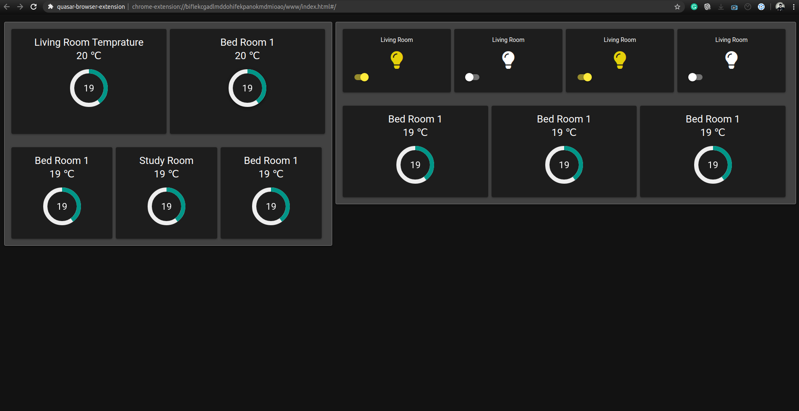

# Quasar App (home_automation_bex)

A Quasar Framework app


### Quasar Hack-a-May Contest

A big shoutout to this amazing framework, I have been using quasar since it's early days and build few amazing web application in my organisation. 

Recently quasar has released this amazing browser extension update and opened up the whole new world of amazing possibilities and ideas,with the power of browser and quasar now your mind is your limit.

### Home Automation

I am big fan of material UI, I have used quasar to build few complex application which have utilized elasticsearch and python. BEX update has allow us to access chrome and it's API. It would be amazing if you could access your devices and appliances using tab in your browser imagine controlling your AC, TV etc just a tab away.

How about getting an various insights in the form of charts and lines, with quasar framework you can connect various charting library at breeze

## Install the dependencies
```bash
npm install
```

### Start the app in development mode (hot-code reloading, error reporting, etc.)
```bash
quasar dev
```


### Build the app for production
```bash
quasar build
```

### Customize the configuration
See [Configuring quasar.conf.js](https://quasar.dev/quasar-cli/quasar-conf-js).

### Screenshot(Still in development)
